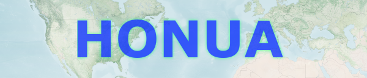
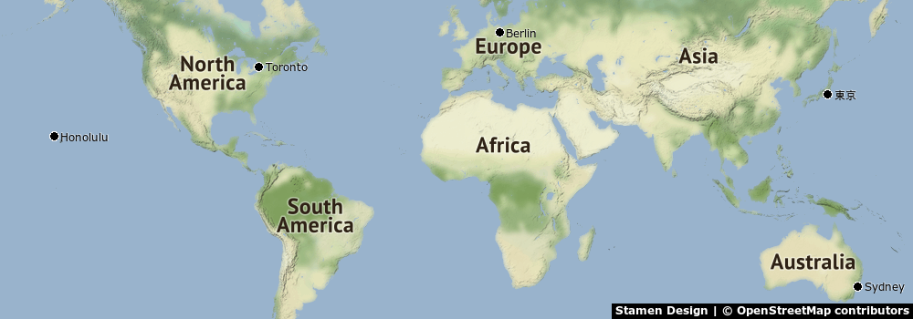
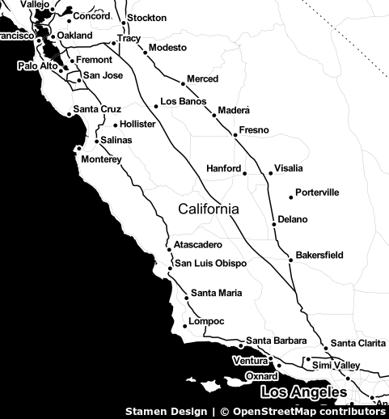
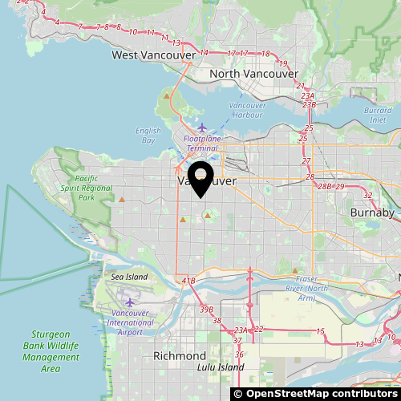

# Honua



> Honua is Hawaiian for earth 🌍

Honua is a simple geographic mapping Library for Ruby. It allows you to stitch geographic map images based on map tiles, provided by a rastered tile server (in Mercator projection). It was highly inspired by [ModestMaps](https://github.com/modestmaps/).

## Requirements

1. [Ruby 3.0](https://www.ruby-lang.org)
2. [libvips](https://libvips.github.io/libvips/)

## Setup

To install, run:
``` ruby
gem install honua
```

Add the following to your Gemfile:

``` ruby
gem "honua"
```

## Usage

### Coordinate Systems

Like almost every popular mapping library it uses the [Web Mercator Projection](https://en.wikipedia.org/wiki/Web_Mercator_projection) as basis for conversions and its tile coordinate system.

* A [Location](lib/honua/location.rb) is a geographic place described in latitude and longitude coordinates in degrees.
* A [Coordinate](lib/honua/coordinate.rb) is a geographic place described in a tile coordinate system with columns (x), rows (y) and a zoom level.

To convert from `Location` to `Coordinate` at a certain zoom level:

1. convert latitude and longitude to radians
2. [reproject coordinates](https://epsg.io/transform#s_srs=4326&t_srs=3857) to Web Mercator projections
3. transform range of `column` and `row` to 0 - 1 and shift origin to top left corner
4. multiply `row` and `column` with number of tiles (2**zoom) and round results

### Configuration

At minimal you need to provide the url for a [tile server](https://github.com/Overv/openstreetmap-tile-server) and the appropriate attribution text for the used tiles. If the map is too small to show the attribution it will be skipped and you need to provide it separetly. Don't forget to check out terms and service for the tile server you are planning to use.

``` ruby
Honua.configure do |config|
  # each zoom level is a directory, each column is a subdirectory, and each tile in that column is a file
  config.tiles_url = 'http://localhost:8080/%<zoom>s/%<column>s/%<row>s.png'
  config.attribution_text = '<b>© OpenStreetMap contributors</b>'
end
```

Checkout [configuration.rb](lib/honua/configuration.rb) for further details.

A map is defined by a center location, map dimensions (width and height in pixels) and a [zoom level](https://wiki.openstreetmap.org/wiki/Zoom_levels). The `draw` method downloads all necessary tiles for the map, stitches them together, adds the proper attribution at the bottom and finally returns a [`Vips::Image`](https://www.rubydoc.info/gems/ruby-vips/Vips/Image).

``` ruby
map_center = Honua::Location.new(35.689487, 139.691711) # Tokyo
map = Honua::Map.new(center: map_center, width: 600, height: 600, zoom: 12)
map_image = map.draw
map_image.write_to_file('tokyo.png') # use Vips to write to file
```

### Helpers

There might be use cases, where you have a bunch of location instead of map center, or you either have map dimensions or a zoom level but not both. Honua includes helpers that can be used to calculate the needed map input parameters:

* [`Honua::Helpers.map_span(locations:)`](lib/honua/helpers.rb) returns the top left and bottom right coordinates at zoom level 0
* [`Honua::Helpers.map_span(top_left:, bottom_right:)`](lib/honua/helpers.rb) returns the center coordinate based on map spanning top left and bottom right coordinates
* [`Honua::Helpers.calculate_zoom(top_left:, bottom_right:, width:, height:)`](lib/honua/helpers.rb) returns zoom level based on map spanning coordinates and map dimensions
* [`Honua::Helpers.calculate_map_dimensions(top_left:, bottom_right:, zoom:)`](lib/honua/helpers.rb) returns map dimensions (in pixels) based on map spanning coordinates and a zoom value
* [`Honua::Helpers.text_label((text:, dpi:, text_colour:, shadow_colour:))`](lib/honua/helpers.rb) generates a text label image with shadow and shadow offset, which can be places on the map.
* [`Honua::Helpers.hex2rgb(hex)`](lib/honua/helpers.rb) converts hex color strings to an array of RGB

Please refer to the [examples](docs) for how these helpers might be used.

[🏙 World & Cities](docs/world_calc_zoom.rb)




[🌉 From SF to LA](docs/from_sf_to_la.rb)




[🇨🇦 Maps of Vancouer](docs/vancouver_maps.rb)



## Development

To contribute, run:

    git clone https://github.com//honua.git
    cd honua
    bundle install

You can also use the IRB console for direct access to all objects:
``` shell
bin/console
```

### Tile Server

If you want to use the included [tile server](https://github.com/Overv/openstreetmap-tile-server) be sure to install [Docker](https://docs.docker.com/engine/install/) and [Docker Compose](https://docs.docker.com/compose/install/).

After you downloaded an `.osm.pbf` extract and `.poly` file from e.g [Geofabrik](https://download.geofabrik.de/) for the region that you're interested in, replace the placeholders in `docker-compose.yml` and run the importer with:
``` shell
docker compose up osmimport

```

To start the tile server, run:
``` shell
docker compose up osmtileserver

```

You can now go to `localhost:8080` for a fullscreen [Leaflet](https://leafletjs.com/) based map. To use the tile server in Honua, add the following configuration in your code:
``` ruby
Honua.configure do |config|
  config.tiles_url = 'http://localhost:8080/tile/%<zoom>s/%<column>s/%<row>s.png'
  config.attribution_text = '<b>© OpenStreetMap contributors</b>' # don't forget to attribute 👍
end
```


😏 If you want to merge 2 or more extracts you can use [osmctools](https://gitlab.com/osm-c-tools/osmctools) or [osmctools-docker](https://github.com/tobilg/osmctools-docker).

## Tests

To test, run:
``` shell
bundle exec rake
```

## Versioning

Read [Semantic Versioning](https://semver.org) for details. Briefly, it means:

- Major (X.y.z) - Incremented for any backwards incompatible public API changes.
- Minor (x.Y.z) - Incremented for new, backwards compatible, public API enhancements/fixes.
- Patch (x.y.Z) - Incremented for small, backwards compatible, bug fixes.

## Contributions

Read [CONTRIBUTING](CONTRIBUTING.md) for details.

## License

Copyright 2021 by dingsdax.
Read [LICENSE](LICENSE) for details.

## History

Read [CHANGES](CHANGES.md) for details.
Built with [Gemsmith](https://www.alchemists.io/projects/gemsmith).

## Further Reading & Credits

Some of the resources that helped building and understanding the underlying logic behind this gem.
This started out as a Ruby port of [modest-maps.js](https://github.com/modestmaps/modestmaps-js) but took on a life of its own. [ModestMaps](https://github.com/modestmaps/) and [Stamen](https://stamen.com/) are awesome! Big shoutout for their work and inspiration 🙇‍♂️.

* [Bing Maps Tile System](https://docs.microsoft.com/en-us/bingmaps/articles/bing-maps-tile-system)
* [OpenLayers FAQ](https://openlayers.org/en/latest/doc/faq.html)
* [OSM Slippy map tilenames](https://wiki.openstreetmap.org/wiki/Slippy_map_tilenames)
* [ModestMaps Wiki](https://github.com/modestmaps/modestmaps-js/wiki)
* [Mercator Projection](https://en.wikipedia.org/wiki/Mercator_projection)
* [Tiles à la Google Maps](https://www.maptiler.com/google-maps-coordinates-tile-bounds-projection)
* [Coordinate Systems Worldwide](https://epsg.io)

## Attributions

<div>Logo & marker icons made by <a href="https://www.freepik.com" title="Freepik">Freepik</a> from <a href="https://www.flaticon.com/" title="Flaticon">www.flaticon.com</a></div>

Toner & Terrain map tiles by [Stamen Design](http://stamen.com),
under [CC BY 3.0](http://creativecommons.org/licenses/by/3.0).
Data by [OpenStreetMap](http://openstreetmap.org), under [ODbL](http://www.openstreetmap.org/copyright).

[Explorer Base Map header image](https://visibleearth.nasa.gov/images/147190/explorer-base-map/147193)
NASA Earth Observatory map by Joshua Stevens using data from NASA’s MODIS Land Cover, the Shuttle Radar Topography Mission (SRTM), the General Bathymetric Chart of the Oceans (GEBCO), and Natural Earth boundaries.
